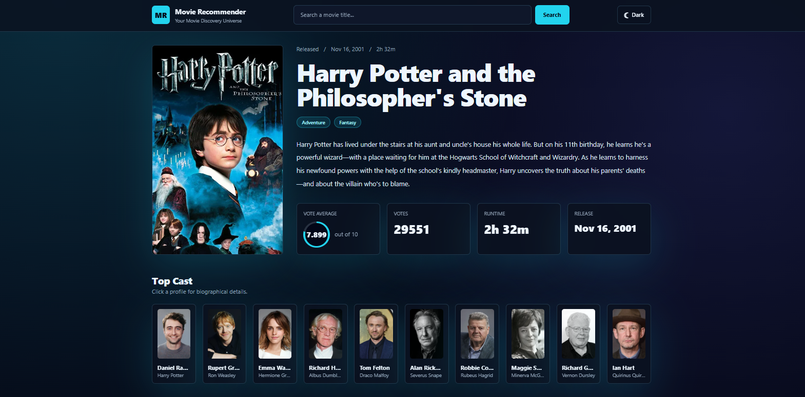
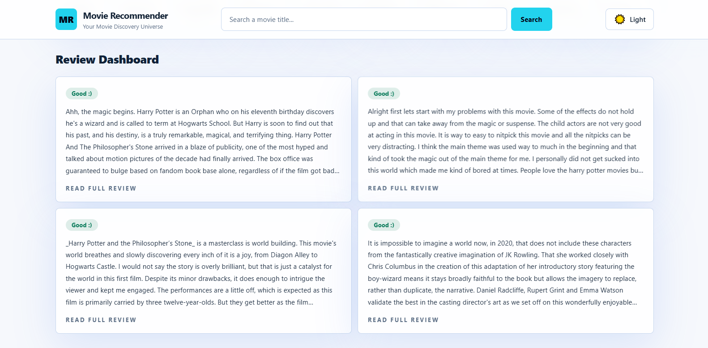
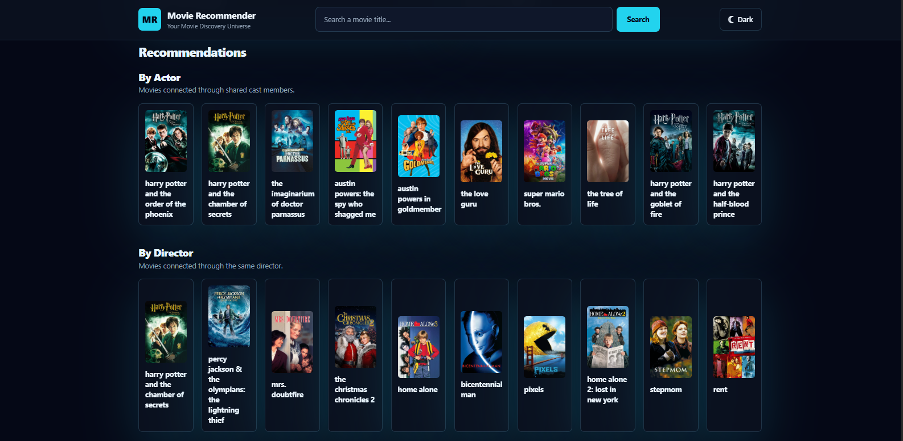

# Movie Recommender

**Author:** Yousef Mohamed

Movie Recommender is a full-stack Flask web application that helps users discover movies through content-based recommendations. The app combines a local machine-learning recommendation model, TMDB movie data, cast biographies, sentiment analysis for reviews, and a modern responsive web interface.


## Deployment
Steps To Deploy The App:

Prepare your dataset:

```text
    1. Data Extraction
    2. Exploratory Data Analysis(EDA)
    3. Feature Engineering
    4. Model Building and Tuning
    5. Building Flask API
    6. Pushing code to Github
    7. Deploy App
```


## Overview

This project recommends movies using local movie metadata such as actors, directors, and genres. After searching for a movie, the app displays a complete movie dashboard with poster, overview, runtime, release date, rating, cast profiles, review sentiment, and categorized recommendations.

The recommendation section is split into three clear groups:

- **Recommendation by Actor**
- **Recommendation by Director**
- **Recommendation by Genre**


## Screenshots






## Features

- Modern responsive movie dashboard
- Search with custom movie title suggestions
- Movie details from TMDB
- Cast cards with biography modal
- Review sentiment analysis using a local NLP model
- Full review modal for reading long reviews
- Recommendations grouped by actor, director, and genre
- Dark and light theme toggle with persistent preference
- Native JavaScript with `fetch`, `async/await`, and `Promise.all`
- Tailwind CSS via CDN
- Flask backend with Jinja2 templates

## Tech Stack

### Backend

- Python
- Flask
- Pandas
- NumPy
- scikit-learn
- BeautifulSoup
- Requests

### Frontend

- HTML
- Jinja2
- Tailwind CSS
- Vanilla JavaScript ES6+
- Fetch API

### Machine Learning

- TF-IDF vectorization for movie similarity
- Cosine similarity for recommendations
- Pickled NLP model for review sentiment analysis

## Project Structure

## Project Structure

```text
Recommendation system/
├── main.py
├── README.md
├── nlp_model.pkl
├── transform.pkl
├── static/
│   └── app.js
├── templates/
│   └── index.html
├── Screenshots/
│   ├── Screen_1.png
│   ├── Screen_2.png
│   └── Screen_3.png
└── Datasets/
    ├── All_Data_movies.csv
    ├── credits.csv
    ├── movie_metadata.csv
    ├── movie_reprocessed.csv
    ├── movie_reprocessed_2.csv
    ├── movie_scraped.csv
    ├── movies_metadata.csv
    └── reviews.txt
```

## Main Files

### `main.py`

The Flask backend. It handles:

- Home page rendering
- Movie title suggestions
- Similarity-based recommendation logic
- Categorized recommendations by actor, director, and genre
- Review sentiment prediction
- Rendering the selected movie dashboard

### `templates/index.html`

The main Jinja2 template. It contains:

- Header and search
- Theme toggle
- Movie hero section
- Cast section
- Review dashboard
- Recommendation sections
- Cast biography modal
- Full review modal

### `static/app.js`

The frontend JavaScript engine. It handles:

- Search workflow
- TMDB API requests
- Concurrent data fetching with `Promise.all`
- Custom suggestions
- Theme switching
- Cast biography modal
- Review modal
- Recursive recommendation browsing

## Recommendation Logic

The app uses `Datasets/All_Data_movies.csv`, which contains:

- `movie_title`
- `director_name`
- `actor_1_name`
- `actor_2_name`
- `actor_3_name`
- `genres`
- `comb`

The recommendation model builds a TF-IDF matrix from the `comb` column and calculates cosine similarity between movies.

When a user selects a movie, recommendations are grouped into:

### Recommendation by Actor

Movies that share one or more main actors with the selected movie.

### Recommendation by Director

Movies directed by the same director.

### Recommendation by Genre

Movies that share genre keywords with the selected movie.

## Sentiment Analysis

The app analyzes movie reviews using:

- `transform.pkl`
- `nlp_model.pkl`

Reviews are fetched from TMDB when available. The backend transforms each review using the saved vectorizer and predicts whether the review is:

- **Good**
- **Bad**

If no reviews are available, the UI shows `Unavailable`.

## TMDB API

The app uses TMDB for:

- Movie details
- Posters
- Cast information
- Cast biographies
- Reviews

The API key is currently configured in `main.py` and can also be overridden with an environment variable:

```powershell
$env:TMDB_API_KEY="your_api_key_here"
```

## How to Run

From the project folder:

```powershell
.\.venv\Scripts\python.exe main.py
```

Then open:

```text
http://127.0.0.1:5000/
```

If the browser shows old JavaScript or styling, hard refresh:

```text
Ctrl + F5
```

## Testing

The project was tested with:

```powershell
.\.venv\Scripts\python.exe -m py_compile main.py
node --check static\app.js
```

A full local catalog recommendation test was also performed:

- Usable movie rows tested: `8,417`
- Unique movie titles tested: `8,410`
- Failures: `0`
- Short recommendation sets: `0`

## Developer Notes

- The app uses one main template: `templates/index.html`.
- Frontend behavior is centralized in `static/app.js`.
- Recommendations are generated locally, while posters and biographies are fetched from TMDB.
- The UI does not depend on Bootstrap or jQuery.
- The theme system is controlled by the `dark` class on the `<html>` element.

## Future Improvements

- Move the TMDB API key into a `.env` file.
- Add automated unit tests with `pytest`.
- Add pagination or lazy loading for large recommendation groups.
- Add user accounts and saved favorite movies.
- Deploy the app to a production server.

## Author

This project was designed, developed, and documented by **Yousef Mohamed**.


<h1 align="left">Hi 👋! My name is Yousef Mohamed</h1>

###

<h2 align="left">🚀 About Me</h2>

###

<p align="left">I'm a Machine Learning Engineer</p>

###

<h3 align="left">🔗 Links</h3>

###

<div align="left">
  <a href="www.linkedin.com/in/yousef-mohamed-5ba742322" target="_blank">
    
  </a>
</div>

###

<h3 align="left">🛠 Skills</h3>

###

<p align="left">- Python  <br>- Statistics <br>- SQL <br>- Machine Learning <br>- Deep Learning<br>- Artificial Intelligence<br>- Data Science</p>

###

<h3 align="left">Summary Of My Journey</h3>

###

<p align="left">✨ Creating bugs since my first Python script<br>📚 I'm currently learning advanced Machine Learning, Deep Learning, NLP, and Computer Vision while building full-stack AI applications<br>🎯 Goals: Become an AI engineer specializing in intelligent systems, recommendation engines, and real-world deep learning solutions<br>🎲 Fun fact: I’m a huge football and Formula 1 fan — I support Al Ahly SC and my favorite F1 driver is Lewis Hamilton 🏎️🔥</p>

###

<h2 align="left">My tech Stack</h2>

###

<div align="left">
  
  
  
  
  
  
  
  
  
  
  
  
  
  
  
</div>

###